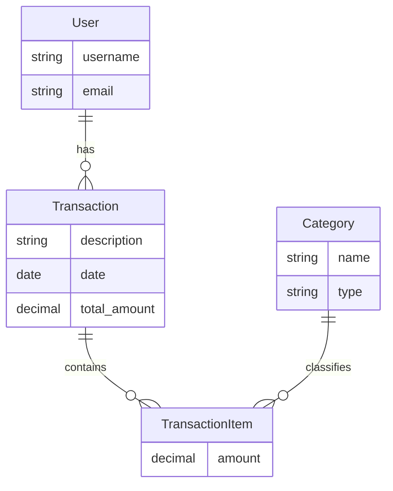

# Sistema de Controle Financeiro

Sistema de controle financeiro pessoal desenvolvido com Django, permitindo o gerenciamento de receitas e despesas com categorias, transações e dashboard com gráficos.

## Funcionalidades

- Cadastro e autenticação de usuários
- Gerenciamento de categorias (receitas e despesas)
- Registro de transações com múltiplos itens
- Dashboard com gráficos e resumo financeiro
- Filtros e buscas nas listagens
- Interface responsiva com Bootstrap 5

## Tecnologias

- Django 5.2.7
- Python 3.10+
- SQLite (banco de dados de desenvolvimento)
- Bootstrap 5 (via CDN)
- Chart.js (via CDN)

## Requisitos

- Python 3.10 ou superior
- Pip (gerenciador de pacotes do Python)

## Como rodar o projeto

1. **Criar um ambiente virtual:**
   ```bash
   python -m venv .venv
   ```

2. **Ativar o ambiente virtual:**
   - No Windows:
     ```bash
     .venv\Scripts\activate
     ```
   - No Linux/Mac:
     ```bash
     source .venv/bin/activate
     ```

3. **Instalar as dependências:**
   ```bash
   pip install -r requirements.txt
   ```

4. **Executar as migrações:**
   ```bash
   python manage.py migrate
   ```

5. **Criar um superusuário (opcional):**
   ```bash
   python manage.py createsuperuser
   ```

6. **Popular o banco de dados com dados de exemplo (opcional):**
   ```bash
   python manage.py seed
   ```
   Usuário de demonstração: `demo@demo.com` / `123456`

7. **Rodar o servidor de desenvolvimento:**
   ```bash
   python manage.py runserver
   ```

8. **Acessar a aplicação:**
   - Aplicação: http://127.0.0.1:8000/
   - Administração: http://127.0.0.1:8000/admin/

## Estrutura do Banco de Dados



## Testes

Para executar os testes:
```bash
python manage.py test
```